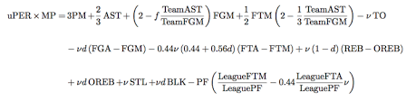

# The Goal
The entire goal of my project was to predict when an NBA player will have his peak season. 
```{r setup, include=FALSE}
knitr::opts_chunk$set(echo = FALSE, warning = FALSE, message = FALSE)
library(tidyverse)
library(GGally)
library(easystats)
library(stringr)
library(caret)
library(plotly)
library(knitr)
library(broom)
library(kableExtra)
```
```{r}
advanced <- read_csv("Data/Advanced.csv") %>% 
  filter(season >= 1997 & season <= 2023, mp >=1500)
```


I did this entirely based on PER, or Player Efficiency Rating.
My initial plan was to come up with a model or new way to calulate something very similar to this, but I didn't know exactly how complicated and accurate PER was. 
Here is a picture of the formula analysts use to find PER.
```{r}

```
Pretty dang complicated right?


# Tidying the Data
The data was already organized fairly well but I did have to select what data I wanted after I finished tidying. 

I filtered the data for multiple reasons. 

First I only wanted data from seasons 1997-2023 because before 1997, the data wasn't complete, and I didn't include the 2024 season because it is the season currently going on right now, and does not have complete data either. 

I filtered to minutes played greater than 1500 a season to filter out bench players, which would skew our PER predictions later. This is players playing an average of 18-24 minutes a game. This is to give a buffer for injuries to starters as well. 

Another filter was that a player needed to play more than 30 games for similar reasons as the minutes. 

I also had to filter on position played, because multiple players had multiple positions played. 
```{r}
replacement_rules <- c("C-PF" = "C", "PF-C" = "PF", "PF-SF" = "PF", "PG-SF" = "PG",
                       "PG-SG" = "PG", "SF-PF" = "SF", "SF-SG" = "SF", "SG-PF" = "SG",
                       "SG-PG" = "SG", "SG-SF" = "SG", "C" = "C", "PF" = "PF", "PG" = "PG", "SF" = "SF", "SG" = "SG")
advanced <- mutate(advanced, 
          new_pos = ifelse(pos == "C-PF", "C",
                    ifelse(pos == "PF-C", "PF",
                    ifelse(pos == "PF-SF", "PF",
                    ifelse(pos == "PG-SF", "PG",
                    ifelse(pos == "PG-SG", "PG",
                    ifelse(pos == "SF-PF", "SF",
                    ifelse(pos == "SF-SG", "SF",
                    ifelse(pos == "SG-PF", "SG",
                    ifelse(pos == "SG-PG", "SG",
                    ifelse(pos == "SG-SF", "SG", pos)))))))))))

```


# Interesting analyses
Almost *all* variables I tested with PER ended up being strongly correlated, however here are some results I found that are pretty interesting. 
This one compares PER on the percentage of attempts a player shoots from the three point line. Surprisingly the more three point shots that centers take the greater their PER whereas other positions PER decreases dramatically.
```{r}
advanced %>% 
  ggplot(aes(x=per, y = x3p_ar))+
  geom_point()+
  geom_smooth(method = "lm")+
  facet_wrap(~new_pos)+
  labs(x="PER", y = "Percentage of Attempts from Three Point Range")+
  theme_minimal()
```

This graph is cool because we see that over time, Centers and Point Guards have gotten "better" or have a larger average PER. Power Forwards, Small Forwards, and Shooting Guards all have gotten "worse" or have a lower average PER. 
```{r}
advanced %>% 
  ggplot(aes(x=season, y = per))+
  geom_point()+
  geom_smooth(method = "lm")+
  facet_wrap(~new_pos)+
  labs(x="Season", y = "PER")+
  theme_minimal()
```


# Modeling
I made several models and as you can see from the comparison graph below, my model 4 seems to fit my data the best to predict PER.

The PER formula for m4 is experience + g + mp + ts_percent + x3p_ar + f_tr + orb_percent + drb_percent + trb_percent + ast_percent + stl_percent + blk_percent+ tov_percent + usg_percent + ows + dws+ ws+ ws_48 + obpm + dbpm + bpm + vorp
```{r}
m1 <- glm(data=advanced,
          formula = per ~ age)
m2 <- glm(data=advanced,
          formula = per ~ experience + g + mp + ts_percent + x3p_ar + f_tr)
m3 <- glm(data=advanced,
          formula = per ~ experience * g * mp * ts_percent * x3p_ar * f_tr)
m4 <- glm(data=advanced,
          formula = per ~ experience + g + mp + ts_percent + x3p_ar + f_tr + orb_percent + drb_percent + trb_percent + ast_percent + stl_percent + blk_percent+ tov_percent + usg_percent + ows + dws+ ws+ ws_48 + obpm + dbpm + bpm + vorp)
m5 <- glm(data=advanced,
          formula = per ~ (experience * ts_percent) + g + x3p_ar + f_tr + orb_percent + drb_percent + trb_percent + ast_percent + stl_percent + blk_percent+ tov_percent + usg_percent + ows + ws_48 + obpm + dbpm + bpm + vorp)
compare_performance(m1,m2,m3,m4,m5) %>% plot
```


# 8 Year Sample
Here is a graph that is the PER for players that have 8 years experience. The graph shows their PER for each season they have played up to their 8th, and a trend line for each player. 
```{r}
sub_dataset_27_2022 <- advanced %>%
  filter(experience ==8, season == 2022) %>%
  select(player_id)

full_subset <- advanced %>%
  filter(player_id %in% sub_dataset_27_2022$player_id)

full_subset %>% 
  ggplot(aes(x = season, y = per, group = player_id, color = player)) +
  geom_line() +
  geom_point() +
  geom_smooth(method = "lm", se= FALSE, aes(group = player_id), color = "black")+
  labs(title = "PER for Players that have 8 years Experience across Seasons",
       x = "Season", y = "PER") +
  theme_minimal()
```

This is just a sample of what the data looks like. 


# Modeling 2
I experimented with using the library caret, which stands for Classification and REgression Training, to increase my knowledge in model training. I set a random seed to split my data into training and testing sets, set up a linear model with the formula from model 4, and predicted the peak season for each NBA player. 
```{r}
peak_seasons <- advanced %>%
  group_by(player_id) %>%
  summarize(peak_season = season[which.max(per)])

data_with_peak <- left_join(advanced, peak_seasons, by = "player_id")

set.seed(123)
train_index <- createDataPartition(data_with_peak$peak_season, p = 0.7, list = FALSE)
train_data <- data_with_peak[train_index, ]
test_data <- data_with_peak[-train_index, ]

lm_model <- lm(peak_season ~ per + experience + ts_percent + mp + g + x3p_ar + f_tr + orb_percent + drb_percent + trb_percent + ast_percent + stl_percent + blk_percent+ tov_percent + usg_percent + ows + dws+ ws+ ws_48 + obpm + dbpm + bpm + vorp, data = train_data)

predicted <- predict(lm_model, newdata = test_data)

predictions <- data.frame(test_data$peak_season, predicted)
colnames(predictions) <- c("Actual_Peak_Season", "Predicted_Peak_Season")

ggplot(predictions, aes(x = Actual_Peak_Season, y = Predicted_Peak_Season)) +
  geom_point() +
  geom_abline(intercept = 0, slope = 1, color = "red", linetype = "dashed") +
  labs(title = "Actual vs. Predicted Peak Seasons based on PER",
       x = "Actual Peak Season", y = "Predicted Peak Season") +
  theme_minimal()
```


# Difference Graphs
This first graph is a really good representation of how accurate my predictions are compared to the last. 
```{r}
rounded_predicted <- round(predicted)
difference_table <- data.frame(Player = test_data$player_id,
                               Actual_Peak_Season = test_data$peak_season,
                               Predicted_Peak_Season = rounded_predicted,
                               Difference = abs(test_data$peak_season - rounded_predicted))


difference_table <- merge(difference_table, test_data[c("player_id", "player")],  by.x = "Player", by.y = "player_id", all.x = TRUE)

ggplot(difference_table, aes(x = Actual_Peak_Season, y = Predicted_Peak_Season)) +
  geom_abline(intercept = 0, slope = 1, linetype = "dashed", color = "gray") +  
  geom_point(aes(size = Difference, color = Difference), alpha = 0.7) +  
  scale_size_continuous(range = c(2, 8)) +  
  labs(title = "Actual vs. Predicted Peak Seasons",
       x = "Actual Peak Season", y = "Predicted Peak Season") +
  theme_minimal()

```

This graph is a really nice and easy to read indicator on how far off my prediction was, and how often.
```{r}
ggplot(difference_table, aes(x = Difference)) +
  geom_density(fill = "skyblue", alpha = 0.6) +
  labs(title = "Density Plot of Differences Between Actual and Predicted Peak Seasons",
       x = "Difference (Absolute Value)", y = "Density") +
  theme_minimal()
```

I also learned about the plotly package, which is primarily used for interactive data visualization.
```{r}
plot_ly(difference_table, x = ~Actual_Peak_Season, y = ~Predicted_Peak_Season, z = ~Difference,
        color = ~Difference, colors = "Blues", marker = list(size = 8, opacity = 0.8)) %>%
  add_markers() %>%
  layout(scene = list(xaxis = list(title = "Actual Peak Season"),
                      yaxis = list(title = "Predicted Peak Season"),
                      zaxis = list(title = "Difference")))
```


# Results
Here are our final results laid out in number and graph format.
```{r}
#average time to peak:
# Filter for players whose first experience is 1
filtered_data <- advanced %>%
  group_by(player_id) %>%
  filter(min(experience) == 1)

# Identify players with their maximum PER experience and their first experience at level 1
max_per_first_exp_at_1 <- filtered_data %>%
  group_by(player_id) %>%
  summarise(max_PER_experience = experience[which.max(per)], first_experience = min(experience))

# Calculate the difference in experiences starting from 1
max_per_first_exp_at_1 <- max_per_first_exp_at_1 %>%
  mutate(experience_difference = max_PER_experience - first_experience)
max_head <- head(max_per_first_exp_at_1)
tidy_max_head <- max_head %>% broom::tidy()
tidy_max_head %>% 
  kable() %>% 
  kable_classic()
plot_ly(
  data = max_per_first_exp_at_1,
  x = ~max_PER_experience,
  y = ~experience_difference,
  type = "bar",
  marker = list(color = 'rgba(50, 171, 96, 0.6)', line = list(color = 'rgba(50, 171, 96, 1.0)', width = 1))
) %>% layout(title = "Summary of Max PER", xaxis = list(title = "Max PER Season"), yaxis = list(title = "Experience Difference"))

```

