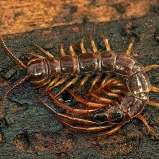

```{r setup, include=FALSE}
knitr::opts_chunk$set(echo = FALSE, warning = FALSE, message = FALSE)
```


This is text. I'm gonna load a data set and try to clean it. 
The data set is summarized below.

```{r}
library(tidyverse)
path <- "./Data/Soil_Predators.csv"
df <- read_csv(path , skip = 1, col_names = FALSE)
badcolnames <- readLines(path, n = 1)
badcolnames <- badcolnames %>% str_replace_all(",_", "_") %>% str_split(",") %>% unlist()
df <- df %>% select(-c(X25,X26))
names(df) <- badcolnames
skimr::skim(df) %>% 
  as.data.frame() %>% 
  kableExtra::kable() %>% 
  kableExtra::kable_classic(lightable_options = 'hover')
```

# NOW I'M GONNA ANALYZE THIS THING...

First, an image:
```{r}

```

List of predator species:

```{r}
df$Predator_species
```


```{r}
df$prey_richness <- 
df %>%select(starts_with("Consumption")) %>% rowSums(na.rm = TRUE)
df %>% 
    ggplot(aes(x=df$Predator_development_stage, y=prey_richness, color = Predator_sex))+
  geom_point()
```